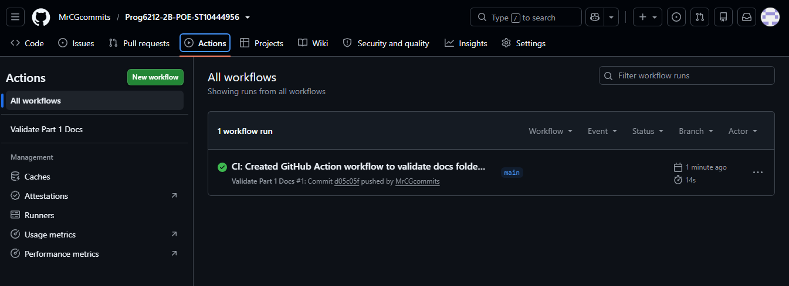

# RaceDay - Event Management System (Part 1)

## System Description
RaceDay is a full-stack web-based event management system designed specifically for the South African road running, walking, and cycling community. The platform allows Event Organisers to create and manage events, categories, and participant results, while Participants can browse events, enter them, track performance, and prepare for race day using live weather and route information.

## User Roles
The system supports two distinct roles:
- **Organiser:** Can create, edit, and delete events, manage event categories, capture participant results, and view all event enrolments.
- **Participant:** Can create an account, browse events, enter an event by selecting a category, view their own enrolments, and track their personal results.

## Update Log
- 2026-09-22: Initial ERD design completed.
- 2026-09-22: Database schema script written and tested in SSMS.
- 2026-09-22: API Endpoint plan finalized.
- 2026-09-22: CI/CD pipeline configured.
- 2026-09-22: Video presentation recorded and uploaded.

## Project Links
- **YouTube Video Presentation:** [Insert Unlisted YouTube Link Here]
- **CI/CD Status:** 
  